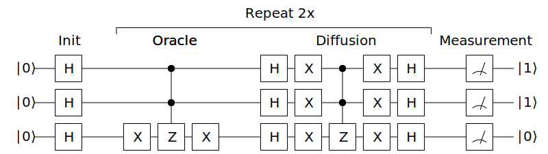
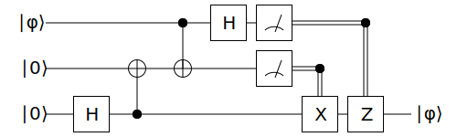

# Quantum computing simulator

# Building blocks

## [Complex numbers](src/main/kotlin/me/khol/quantum/math/Complex.kt)
<details>
<summary>Details</summary>

Complex numbers can be created either from cartesian coordinates:
```kotlin
Complex(re: Number = 0, im: Number = 0)
```
or from polar coordinates:
```kotlin
Complex.fromPolar(theta: Number, radius: Number = 1)
```
For most commonly used Complex numbers there are three predefined values:
```kotlin
val ONE = Complex(1, 0)
val ZERO = Complex(0, 0)
val I = Complex(0, 1)
```
There are several overloaded operators that allow for easier addition, subtraction, multiplication 
and division of complex numbers.
</details>  

## [Matrices](src/main/kotlin/me/khol/quantum/math/Matrix.kt)
<details>
<summary>Details</summary>

Matrices can be created from number of rows and cols and 1D array of complex numbers:
```kotlin
Matrix(rows: Int, cols: Int, vararg values: Complex)
```
or directly from 2D array of complex numbers:
```kotlin
Matrix(m: List<List<Complex>>)
```
Identity matrix n×n can be created using:
```kotlin
Matrix.identity(size: Int)
```
There are many overloaded operators that allow for easier *addition* and *subtraction* of two 
matrices, *multiplication* and *division* by a number, complex number or another matrix, 
*conjugate transpose* and *tensor* product. 
</details>  

## [Qubits](src/main/kotlin/me/khol/quantum/Qubit.kt) 
Qubits are defined by two complex numbers which define their probability amplitudes:
```kotlin
Qubit(alpha: Complex, beta: Complex)
```
Two commonly used qubit states are predefined:
```kotlin
val ZERO = Qubit(Complex.ONE, Complex.ZERO)
val ONE = Qubit(Complex.ZERO, Complex.ONE)
```

Qubits can be converted to *bra* ⟨&phi;∣ or *ket* ∣&phi;⟩ matrices and define *dot*, *cross* 
and *tensor* products.

Because two qubits may have different alpha and beta values although they represent the same
physical state they can be *normalized* so that two qubits can be programmatically compared.
This cannot be observed in the physical world but is invaluable in testing.

## [Registers](src/main/kotlin/me/khol/quantum/Register.kt)
Registers are created from a list of qubits:
```kotlin
Register(vararg qubits: Qubit)
```

In contrast to a simple `List<Qubit>` that can only hold independent qubits, a `Register` can
also hold *entangled* qubits, such as *Bell states*.

With the same reasoning as for qubits, registers can be *normalized* for testing purposes.

## [Gates](src/main/kotlin/me/khol/quantum/gate/Gate.kt)
Most of the commonly used gates are already predefined:

| [Identity][_Identity] | [Hadamard][_Hadamard] | [X (Not)][_X] | [Y][_Y] | [Z][_Z] |
|-----------------------|-----------------------|---------------|---------|---------|
| ![Identity][Identity] | ![Hadamard][Hadamard] | ![X (Not)][X] | ![Y][Y] | ![Z][Z] |

| [S][_S] | [T][_T] | [Phase][_Phase] | [Swap][_Swap] | [CNot (CX)][_CNot] |
|---------|---------|-----------------|---------------|--------------------|
| ![S][S] | ![T][T] | ![Phase][Phase] | ![Swap][Swap] | ![CNot (CX)][CNot] |

| [Toffoli (CCNot)][_CCNot] | [Fredkin (CSwap)][_CSwap] | [Controlled][_Controlled] |
|---------------------------|---------------------------|---------------------------|
| ![Toffoli (CCNot)][CCNot] | ![Fredkin (CSwap)][CSwap] | ![Controlled][Controlled] |

[//]: https://alexanderrodin.com/github-latex-markdown/

[//]: <> ( \begin{bmatrix} 1 & 0 \\ 0 & 1 \end{bmatrix} )
[Identity]: https://render.githubusercontent.com/render/math?math=%5Cbegin%7Bbmatrix%7D%201%20%26%200%20%5C%5C%200%20%26%201%20%5Cend%7Bbmatrix%7D
[_Identity]: src/main/kotlin/me/khol/quantum/gate/GateIdentity.kt
[//]: <> ( \frac{1}{\sqrt{2}} \begin{bmatrix} 1 & \phantom{-}1 \\ 1 & -1 \end{bmatrix} )
[Hadamard]: https://render.githubusercontent.com/render/math?math=%5Cfrac%7B1%7D%7B%5Csqrt%7B2%7D%7D%20%5Cbegin%7Bbmatrix%7D%201%20%26%20%5Cphantom%7B-%7D1%20%5C%5C%201%20%26%20-1%20%5Cend%7Bbmatrix%7D
[_Hadamard]: src/main/kotlin/me/khol/quantum/gate/GateHadamard.kt
[X//]: <> ( \begin{bmatrix} 0 & 1 \\ 1 & 0 \end{bmatrix} )
[X]: https://render.githubusercontent.com/render/math?math=%5Cbegin%7Bbmatrix%7D%200%20%26%201%20%5C%5C%201%20%26%200%20%5Cend%7Bbmatrix%7D
[_X]: src/main/kotlin/me/khol/quantum/gate/GateX.kt
[Y//]: <> ( \begin{bmatrix} 0 & -i \\ i & \phantom{-}0 \end{bmatrix} )
[Y]: https://render.githubusercontent.com/render/math?math=%5Cbegin%7Bbmatrix%7D%200%20%26%20-i%20%5C%5C%20i%20%26%20%5Cphantom%7B-%7D0%20%5Cend%7Bbmatrix%7D
[_Y]: src/main/kotlin/me/khol/quantum/gate/GateY.kt
[Z//]: <> ( \begin{bmatrix} 1 & \phantom{-}0 \\ 0 & -1 \end{bmatrix} )
[Z]: https://render.githubusercontent.com/render/math?math=%5Cbegin%7Bbmatrix%7D%201%20%26%20%5Cphantom%7B-%7D0%20%5C%5C%200%20%26%20-1%20%5Cend%7Bbmatrix%7D
[_Z]: src/main/kotlin/me/khol/quantum/gate/GateZ.kt
[//]: <>  ( \begin{bmatrix} 1 & 0 \\ 0 & i \end{bmatrix} )
[S]: https://render.githubusercontent.com/render/math?math=%5Cbegin%7Bbmatrix%7D%201%20%26%200%20%5C%5C%200%20%26%20i%20%5Cend%7Bbmatrix%7D
[_S]: src/main/kotlin/me/khol/quantum/gate/GateS.kt
[//]: <>  ( \begin{bmatrix} 1 & 0 \\ 0 & e^{i\pi/4} \end{bmatrix} )
[T]: https://render.githubusercontent.com/render/math?math=%5Cbegin%7Bbmatrix%7D%201%20%26%200%20%5C%5C%200%20%26%20e%5E%7Bi%5Cpi%2F4%7D%20%5Cend%7Bbmatrix%7D
[_T]: src/main/kotlin/me/khol/quantum/gate/GateT.kt
[//]: <>  ( \begin{bmatrix} 1 & 0 \\ 0 & e^{i\theta} \end{bmatrix} )
[Phase]: https://render.githubusercontent.com/render/math?math=%5Cbegin%7Bbmatrix%7D%201%20%26%200%20%5C%5C%200%20%26%20e%5E%7Bi%5Ctheta%7D%20%5Cend%7Bbmatrix%7D
[_Phase]: src/main/kotlin/me/khol/quantum/gate/GatePhase.kt
[//]: <>  ( \begin{bmatrix} 1 & 0 & 0 & 0 \\ 0 & 0 & 1 & 0 \\ 0 & 1 & 0 & 0 \\ 0 & 0 & 0 & 1 \end{bmatrix} )
[Swap]: https://render.githubusercontent.com/render/math?math=%5Cbegin%7Bbmatrix%7D%201%20%26%200%20%26%200%20%26%200%20%5C%5C%200%20%26%200%20%26%201%20%26%200%20%5C%5C%200%20%26%201%20%26%200%20%26%200%20%5C%5C%200%20%26%200%20%26%200%20%26%201%20%5Cend%7Bbmatrix%7D
[_Swap]: src/main/kotlin/me/khol/quantum/gate/GateSwap.kt
[//]: <>  ( \begin{bmatrix} 1 & 0 & 0 & 0 \\ 0 & 1 & 0 & 0 \\ 0 & 0 & 0 & 1 \\ 0 & 0 & 1 & 0 \end{bmatrix} )
[CNot]: https://render.githubusercontent.com/render/math?math=%5Cbegin%7Bbmatrix%7D%201%20%26%200%20%26%200%20%26%200%20%5C%5C%200%20%26%201%20%26%200%20%26%200%20%5C%5C%200%20%26%200%20%26%200%20%26%201%20%5C%5C%200%20%26%200%20%26%201%20%26%200%20%5Cend%7Bbmatrix%7D
[_CNot]: src/main/kotlin/me/khol/quantum/gate/GateCNot.kt
[//]: <>  ( \begin{bmatrix} 1 & 0 & 0 & 0 & 0 & 0 & 0 & 0 \\ 0 & 1 & 0 & 0 & 0 & 0 & 0 & 0 \\ 0 & 0 & 1 & 0 & 0 & 0 & 0 & 0 \\ 0 & 0 & 0 & 1 & 0 & 0 & 0 & 0 \\ 0 & 0 & 0 & 0 & 1 & 0 & 0 & 0 \\ 0 & 0 & 0 & 0 & 0 & 1 & 0 & 0 \\ 0 & 0 & 0 & 0 & 0 & 0 & 0 & 1 \\ 0 & 0 & 0 & 0 & 0 & 0 & 1 & 0 \end{bmatrix} )
[CCNot]: https://render.githubusercontent.com/render/math?math=%5Cbegin%7Bbmatrix%7D%201%20%26%200%20%26%200%20%26%200%20%26%200%20%26%200%20%26%200%20%26%200%20%5C%5C%200%20%26%201%20%26%200%20%26%200%20%26%200%20%26%200%20%26%200%20%26%200%20%5C%5C%200%20%26%200%20%26%201%20%26%200%20%26%200%20%26%200%20%26%200%20%26%200%20%5C%5C%200%20%26%200%20%26%200%20%26%201%20%26%200%20%26%200%20%26%200%20%26%200%20%5C%5C%200%20%26%200%20%26%200%20%26%200%20%26%201%20%26%200%20%26%200%20%26%200%20%5C%5C%200%20%26%200%20%26%200%20%26%200%20%26%200%20%26%201%20%26%200%20%26%200%20%5C%5C%200%20%26%200%20%26%200%20%26%200%20%26%200%20%26%200%20%26%200%20%26%201%20%5C%5C%200%20%26%200%20%26%200%20%26%200%20%26%200%20%26%200%20%26%201%20%26%200%20%5Cend%7Bbmatrix%7D
[_CCNot]: src/main/kotlin/me/khol/quantum/gate/GateCCNot.kt
[//]: <>  ( \left[\begin{bmatrix} 1 & 0 & 0 & 0 & 0 & 0 & 0 & 0 \\ 0 & 1 & 0 & 0 & 0 & 0 & 0 & 0 \\ 0 & 0 & 1 & 0 & 0 & 0 & 0 & 0 \\ 0 & 0 & 0 & 1 & 0 & 0 & 0 & 0 \\ 0 & 0 & 0 & 0 & 1 & 0 & 0 & 0 \\ 0 & 0 & 0 & 0 & 0 & 0 & 1 & 0 \\ 0 & 0 & 0 & 0 & 0 & 1 & 0 & 0 \\ 0 & 0 & 0 & 0 & 0 & 0 & 0 & 1 \end{bmatrix}\right] )
[CSwap]: https://render.githubusercontent.com/render/math?math=%5Cbegin%7Bbmatrix%7D%201%20%26%200%20%26%200%20%26%200%20%26%200%20%26%200%20%26%200%20%26%200%20%5C%5C%200%20%26%201%20%26%200%20%26%200%20%26%200%20%26%200%20%26%200%20%26%200%20%5C%5C%200%20%26%200%20%26%201%20%26%200%20%26%200%20%26%200%20%26%200%20%26%200%20%5C%5C%200%20%26%200%20%26%200%20%26%201%20%26%200%20%26%200%20%26%200%20%26%200%20%5C%5C%200%20%26%200%20%26%200%20%26%200%20%26%201%20%26%200%20%26%200%20%26%200%20%5C%5C%200%20%26%200%20%26%200%20%26%200%20%26%200%20%26%200%20%26%201%20%26%200%20%5C%5C%200%20%26%200%20%26%200%20%26%200%20%26%200%20%26%201%20%26%200%20%26%200%20%5C%5C%200%20%26%200%20%26%200%20%26%200%20%26%200%20%26%200%20%26%200%20%26%201%20%5Cend%7Bbmatrix%7D
[_CSwap]: src/main/kotlin/me/khol/quantum/gate/GateCSwap.kt
[//]: <>  ( \begin{bmatrix} 1 & 0 & 0 & 0 \\ 0 & 1 & 0 & 0 \\ 0 & 0 & u_00 & u_01 \\ 0 & 0 & u_10 & u_11 \end{bmatrix} )
[Controlled]: https://render.githubusercontent.com/render/math?math=%5Cbegin%7Bbmatrix%7D%201%20%26%200%20%26%200%20%26%200%20%5C%5C%200%20%26%201%20%26%200%20%26%200%20%5C%5C%200%20%26%200%20%26%20u_00%20%26%20u_01%20%5C%5C%200%20%26%200%20%26%20u_10%20%26%20u_11%20%5Cend%7Bbmatrix%7D
[_Controlled]: src/main/kotlin/me/khol/quantum/gate/GateControlled.kt

It should be rather straightforward to create custom gates.

Gates can be applied to a single Qubit or Register. 
The size of the gate must match the number of qubits stored by Register or 1 in the case of Qubit.
```kotlin
GateX * Qubit.ONE // Qubit.ZERO

GateSwap * Register(Qubit.ONE, Qubit.ZERO) // Register(Qubit.ZERO, Qubit.ONE)
``` 

## [Algorithms](src/main/kotlin/me/khol/quantum/Algorithm.kt)
Instead of manually applying gates to registers and qubits like this:
```kotlin
val bellState = CNot * Register(Hadamard * ZERO, ZERO)
```
algorithm classes provide a less cluttered and more natural way to 
* combine multiple gates into one,
* reorder inputs of a gate,
* apply gates to registers with different sizes and
* apply multiple gates to a register.

### GateAlgorithm
Pre-computes application of multiple gates as a standalone gate. As we apply gates 
within the algorithm their transformation matrices are combined.
It allows us to pre-compute a part of an algorithm that is executed repeatedly and 
apply the result gate instead.
    
```kotlin
// Swap gate made using CNot gates 
val swap: Gate = gateAlgorithm(2) {
    CNot[0, 1]
    CNot[1, 0]
    CNot[0, 1]
}
```

### RunnableAlgorithm
Applies multiple gates to a register, changing the state of its qubits with each step.

```kotlin
// Fully entangled Bell state (∣00⟩ + ∣11⟩) / sqrt(2)  
val bellState: Register = runnableAlgorithm(2) {
    GateHadamard[0]
    GateCNot[0, 1]
}
```

Compared to `gateAlgorithm` that does not have any state per se, `runnableAlgorithm` has a register
that we can measure at any point. 

```kotlin
fun measureAndCollapse(vararg qubitIndices: Int): List<Qubit>
```

Doing so will collapse the state of specified qubits to ∣0⟩ or ∣1⟩ based on their probabilities. 
Other qubits in the register entangled with any of the measured qubits will have their probabilities
updated as well to satisfy constraints imposed by entangled states before the measurement.

# Algorithm examples

## Grover's Algorithm



```kotlin
val oracle: Gate = oracleGate(ONE, ONE, ZERO)

runnableAlgorithm(3) {
    // Initialization
    step { H[0]; H[1]; H[2] }

    repeat(2) {
        // Oracle
        oracle[0, 1, 2]

        // Diffusion
        step { H[0]; H[1]; H[2] }
        step { X[0]; X[1]; X[2] }
        step { C(C(Z))[0, 1, 2] }
        step { X[0]; X[1]; X[2] }
        step { H[0]; H[1]; H[2] }
    }

    // Measurement
}.measure() // Returns [ONE, ONE, ZERO] with high probability
```

## Quantum Teleportation



```kotlin
val message = ZERO // or ONE or random()

runnableAlgorithm(Register(message, ZERO, ZERO)) {
    // Entangle qubits q1 and q2 to form a fully entangled bell state
    GateHadamard[2]
    GateCNot[2, 1]

    // Entangle message/state held by q0 with the rest.
    GateCNot[0, 1]
    GateHadamard[0]

    // Measuring the first two qubits will change the state of the third qubit because
    // of the entanglement. This will teleport the message from the first qubit to the
    // third qubit.
    val (secret, shared) = measureAndCollapse(0, 1)

    // The last qubit can be in one of four superpositions now. We can use qubits
    // measured in the previous step to conditionally apply some gates to put it
    // into one specific superposition.
    if (shared == ONE) GateX[2]
    if (secret == ONE) GateZ[2]
}

// At this point the third qubit will be in the same superposition as the message
// defined at the beginning.
```
